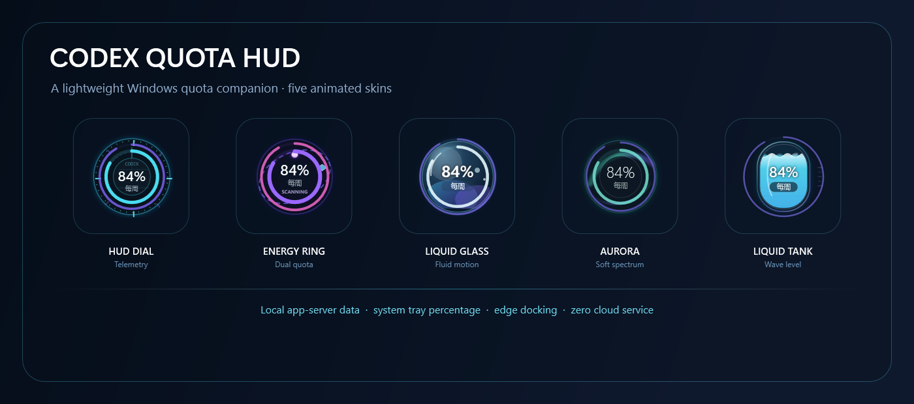

# Codex Quota HUD

[](https://github.com/yaoziqin2020/codex-quota-hud/actions/workflows/ci.yml)
[](https://github.com/yaoziqin2020/codex-quota-hud/releases/latest)
[](LICENSE)
[](#系统要求--requirements)

Codex Quota HUD 是一个轻量的 Windows 桌面额度浮窗。它读取本机
`codex app-server` 返回的官方额度数据，以常驻桌面的动态浮窗、藏边进度条
和数字托盘图标展示 5 小时与每周剩余额度。

Codex Quota HUD is a lightweight Windows desktop companion that visualizes
the five-hour and weekly quota data returned by the local
`codex app-server`. It provides an animated floating HUD, a themed edge bar,
and a numeric tray icon without scraping web pages or storing credentials.

> 这是一个独立开源项目，并非 OpenAI 官方产品。
>
> This is an independent open-source project and is not an official OpenAI
> product.



## 功能 / Features

- 同时显示 5 小时额度与每周额度；缺少某一窗口时自动退化为单层显示
- 后台每 60 秒刷新，双击浮窗可立即刷新
- 单击查看重置时间、最近更新时间和当前剩余比例
- 五套动态皮肤：科技仪表、双彩能量环、流体玻璃球、克制极光、液位储能舱
- 读取期间动画加速，空闲时低帧率缓慢运行，隐藏后停止动画
- 拖到显示器外侧边缘后自动收起为对应皮肤的额度进度条
- 多显示器与不同 DPI 下按当前工作区保存和恢复位置
- 托盘图标直接显示当前剩余百分比，并提供刷新、皮肤、动画和退出菜单
- 单实例运行、静默启动、当前用户开机启动与安全卸载
- 不读取浏览器 Cookie，不保存 OAuth Token，不开放网络端口

## 下载与安装 / Download

从 [最新 Release](https://github.com/yaoziqin2020/codex-quota-hud/releases/latest)
下载 `CodexQuotaHud-v1.0.0-win-x64.zip`，解压后在该目录运行：

```powershell
powershell -ExecutionPolicy Bypass -File .\scripts\install.ps1
```

程序会安装到：

```text
%LOCALAPPDATA%\Programs\CodexQuotaHud
```

安装脚本会启动一个后台实例，并为当前 Windows 用户添加
`Run\CodexQuotaHud` 启动项。不会弹出黑色命令窗口。

卸载：

```powershell
powershell -ExecutionPolicy Bypass -File .\scripts\uninstall.ps1
```

## 操作 / Controls

| 操作 | 结果 |
|---|---|
| 单击浮窗 | 显示或关闭额度详情 |
| 双击浮窗 | 立即刷新额度 |
| 拖动浮窗 | 自由移动并保存位置 |
| 右键浮窗 | 打开皮肤、动画、刷新和退出菜单 |
| 移入藏边条 | 展开浮窗 |
| 右键托盘图标 | 打开完整控制菜单 |

浮窗靠近当前显示器的外侧边缘后，会在鼠标离开约 5 秒后收起，只留下
24px 可见区域中的主题额度条。共享边缘不会误触发藏边；顶部、底部和副屏
外侧边缘均按实际显示器布局判断。

## 额度显示 / Quota Display

中央数字表示当前主要额度窗口：

- 同时读到两项时：中央显示 5 小时额度，外层显示每周额度
- 只读到每周额度时：自动显示为单层“每周”
- 只读到 5 小时额度时：自动显示为单层“5 小时”
- 两项都读不到时：隐藏浮窗，不用占位值冒充真实额度

剩余百分比来自官方返回的 `usedPercent`，按
`100 - usedPercent` 计算并限制在 `0%..100%`。

## 五套皮肤 / Skins

| ID | 名称 | 视觉特点 |
|---|---|---|
| `HudDial` | HUD 科技仪表 | 双向扫描刻度与青蓝仪表环 |
| `EnergyRing` | 双彩能量环 | 紫罗兰能量弧与倾斜轨道 |
| `LiquidGlass` | 流体玻璃球 | 半透明玻璃、柔光与流体感 |
| `Aurora` | 克制极光 | 低饱和青绿极光带 |
| `LiquidTank` | 液位储能舱 | 真实额度水位与缓慢波面 |

皮肤、动画开关、窗口位置和最近成功刷新时间保存在当前用户的本地设置中。

## 隐私与安全 / Privacy

Codex Quota HUD：

- 不读取或保存浏览器 Cookie
- 不读取或保存 OAuth Token、账号信息或额度响应正文
- 不抓取 Codex 网页，也不调用私有网页接口
- 不开放本地或远程网络端口
- 只通过本机 `codex app-server` 子进程读取额度
- 只保存窗口坐标、动画开关、皮肤和最近成功刷新时间

安装和卸载脚本只操作精确的
`%LOCALAPPDATA%\Programs\CodexQuotaHud` 路径与当前用户启动项，并在移动、
替换或删除前检查目标路径和重解析点。

## 系统要求 / Requirements

- Windows 10/11 x64
- Codex Desktop 或可用的 `codex` CLI
- 从源码构建需要 .NET SDK `9.0.316`
- Release 为自包含 `win-x64` 单文件版本，无需另装 .NET Runtime

项目使用 `codex app-server` 的标准输入输出 JSONL 协议：
[OpenAI Codex app-server README](https://github.com/openai/codex/blob/main/codex-rs/app-server/README.md)。

## 从源码运行 / Build from Source

```powershell
git clone https://github.com/yaoziqin2020/codex-quota-hud.git
cd codex-quota-hud
dotnet restore .\CodexQuotaHud.sln
dotnet test .\CodexQuotaHud.sln -c Release --no-restore
dotnet build .\CodexQuotaHud.sln -c Release --no-restore
```

### 开发预览 / Developer Preview

当真实 5 小时额度暂时不可用时，可启动隔离的视觉预览工具：

```powershell
dotnet run --project .\src\CodexQuotaHud.App -- --preview
```

控制面板可切换双额度、仅 5 小时、仅每周和无额度状态，并调整百分比、
皮肤、动画、详情及四方向藏边。预览数据只存在于内存，不连接
`codex app-server`，不注册开机启动，也不写入正式设置。它用于视觉与交互
验收，不能替代真实双额度数据恢复后的最终链路验证。

生成自包含版本：

```powershell
powershell -ExecutionPolicy Bypass -File .\scripts\publish.ps1
```

生成可发布 ZIP：

```powershell
powershell -ExecutionPolicy Bypass -File .\scripts\package-release.ps1 -Version 1.0.0
```

## 项目结构 / Project Structure

```text
src/CodexQuotaHud.Core/       额度模型、映射、刷新状态和设置
src/CodexQuotaHud.App/        WPF 浮窗、皮肤、托盘与 app-server 集成
tests/                        Core 与 Windows UI 自动化测试
scripts/                      发布、安装、卸载和 Release 打包脚本
docs/                         设计、实现计划、验收记录和预览资源
.github/workflows/            Windows CI
```

## 验证 / Verification

当前源码包含 253 项自动化测试：

- Core：55 项
- App / UI：198 项

```powershell
dotnet test .\CodexQuotaHud.sln -c Release --no-restore
dotnet build .\CodexQuotaHud.sln -c Release --no-restore
```

GitHub Actions 会在每次推送和拉取请求中执行恢复、测试、构建和 Windows
自包含发布检查。

## 许可证 / License

Released under the [MIT License](LICENSE).
