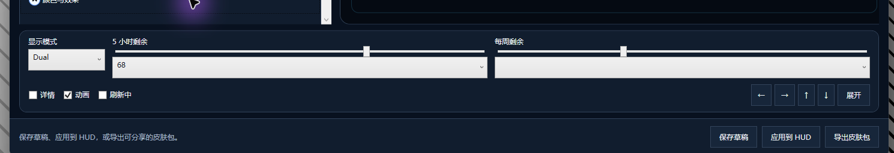

# Optional Skin Designer Acceptance — v1.2.0 Release Record

## Scope and release boundary

This record covers the optional Skin Designer and safe `.cqskin` runtime/import work developed after the public `v1.1.1` release and later published as `v1.2.0`. The `v1.1.1` Setup/ZIP names, sizes, hashes, tag, and release evidence elsewhere in this repository remain historical facts and are not evidence for this feature.

The original Task 18 boundary authorized only an ephemeral internal `0.0.0` build in a unique system-temporary directory. Later user instructions separately authorized GUI acceptance, production packages/installs, and public `main`/tag/GitHub Release work. The current release decisions supersede the original authorization boundary without rewriting historical row results.

Evidence states are `PASS`, `PARTIAL`, `FAIL`, and `NOT RUN`. A row moves to `PASS` only from direct evidence collected for that exact row. Automated PASS cannot make the overall feature acceptance PASS.

## 2026-08-05 v1.2.3 release — installed, user-accepted, and published

This release combines the themed Designer dialogs and refresh-animation
timing plans. Final source is
`c66cf9d5d135b864ad90af5c74455177902c7c04`. Local installation and bounded
GUI smoke are complete. The user then tested the exact installed candidate,
reported no issues, and authorized complete Git synchronization and release.
Automated or practical acceptance does not promote unperformed exhaustive GUI
rows.

| Status | Date/time (Asia/Tokyo) | Command or action | Expected | Observed | Evidence |
|---|---|---|---|---|---|
| PASS | 2026-08-05 +09:00 | `dotnet test .\CodexQuotaHud.sln -c Release --no-restore` | All current projects execute with zero failures/skips | Core `75/75`, Skins `355/355`, App/UI `622/622`, Designer `395/395`; total `1447/1447`, failed `0`, skipped `0` | Fresh complete VSTest summaries and exit `0` after final review fixes; one preceding closeout run was excluded because the installed Designer left open for GUI handoff held the product mutex and failed exactly three single-instance guard tests, then the unchanged command passed after that exact process closed |
| PARTIAL | 2026-08-05 03:02 +09:00 | First post-acceptance GitHub CI attempt | Full CI passes on the accepted source | Product result succeeded, but `Server_RealPipeNearCommitCutoffSucceedsBeforeClientDeadline` took `2.815 s` under Runner load and failed only its redundant `<1.9 s` elapsed assertion; App `621/622`, all other test projects passed | GitHub Actions run `30936427590`, attempt 1, job `92083625341` |
| PARTIAL | 2026-08-05 03:10 +09:00 | Rerun the same GitHub CI without code changes | Distinguish one-off scheduling noise from a repeated test-design problem | A different real-WPF activation test completed its product assertions but timed out during the fixed three-second shutdown guard; App `621/622`, all other test projects passed | GitHub Actions run `30936427590`, attempt 2, job `92085803839` |
| PASS | 2026-08-05 03:18 +09:00 | Test-only timing stabilization plus focused and full local reruns | Remove scheduler speed from correctness assertions without changing product timeout behavior | Redundant elapsed assertions removed; real-window class joined serial WPF collection; cleanup uses a 15-second deadlock guard. Focused `33/33`; full Core `75/75`, Skins `355/355`, App/UI `622/622`, Designer `395/395`; total `1447/1447` | Fresh local VSTest summaries and exit `0`; project `AGENTS.md` timing-test rule |
| PASS | 2026-08-05 03:39 +09:00 | GitHub Actions run `30938108523` on `0f42c5d` | Full remote gate passes after timing-test stabilization | Test, Build, ephemeral CI candidate packaging, and isolated installer smoke all completed successfully; job conclusion `success` | [GitHub Actions job `92089266406`](https://github.com/yaoziqin2020/codex-quota-hud/actions/runs/30938108523/job/92089266406) and public API readback |
| PASS | 2026-08-05 03:47 +09:00 | Publish annotated tag and GitHub Release `v1.2.3`, then download every uploaded asset | Latest non-draft/non-prerelease Release points to the tested commit; three immutable production assets match local files | Tag dereferences to `0f42c5d`; Setup, ZIP, and checksum file have exact expected names/sizes/API digests; fresh downloads reproduced all three local SHA-256 values | [GitHub Release v1.2.3](https://github.com/yaoziqin2020/codex-quota-hud/releases/tag/v1.2.3), remote tag/API readback, and downloaded-file hashes |
| PASS | 2026-08-04 23:33 +09:00 | `dotnet build .\CodexQuotaHud.sln -c Release --no-restore` and `git diff --check` | Build and source formatting gate pass | Build `0` warnings / `0` errors; diff check had no output | Fresh stdout and exit `0` |
| PASS | 2026-08-05 +09:00 | `.\scripts\package-release.ps1 -Version 1.2.3` | Canonical Setup, normal-only ZIP, and checksum manifest are created from final v1.2.3 publish output | Inno Setup `6.7.3` compiled successfully from `c66cf9d`; exact authorized rerun exited `0` | Packaging stdout, artifact inventory, and checksum readback |
| PASS | 2026-08-05 +09:00 | `.\scripts\test-installer.ps1 -Version 1.2.3 -InstallerPath .\artifacts\release\CodexQuotaHud-Setup-v1.2.3.exe` | Seven normal plus two committed-cleanup failure scenarios pass without changing production state | All nine passed in `946.3 s`; every successful GUID root was removed with checked postconditions; production registry snapshots remained unchanged | Full scenario stdout and exit `0` |
| PARTIAL | 2026-08-04 23:40 +09:00 | First restricted installer-smoke attempt | Test must have permission to create only its isolated HKCU test key | `fresh-default` reached the GUID-scoped registry write, then Inno received error 5 because the sandbox denied `HKCU\Software\CodexQuotaHud.Tests\<guid>\Run`; it rolled back and was not counted as product evidence | Preserved `clean-install.log`; exact diagnostic temp root later removed with `ExistsAfter=False` |
| PASS | 2026-08-05 +09:00 | Candidate hash, manifest, structure, version, signature, and residue inspection | Exact immutable local evidence exists before installation | Setup 100,048,867 bytes / `579c1ce73392970e93323c99600f013950cc463bc4bb5c4b305085584f743f80`; ZIP 68,335,551 bytes / `16bf2692d591d039014cd2976cd639de5b5c599f19826b8a07e7e0a1631504d1`; checksum file 196 bytes / `dce728ee15522ffdaabf841c11f90310ddc5342a920b01eada41730fa04d2771`; two manifest lines match | Fresh `Get-FileHash`, manifest comparison, ZIP/publish inventories, version resources, `Get-AuthenticodeSignature`, and root/process checks |
| PASS | 2026-08-04 23:58 +09:00 | ZIP and Setup payload boundary | ZIP remains normal-HUD-only; Setup carries Designer only as optional payload | ZIP exactly `LICENSE`, `README.md`, App, `scripts/install.ps1`, `scripts/uninstall.ps1`; no Designer. Publish tree exactly App plus `designer/CodexQuotaHud.SkinDesigner.exe`; isolated default install excludes Designer and selected install includes it | ZIP archive entries, publish-tree inventory, and passing `fresh-default` / `fresh-designer` scenarios |
| PASS | 2026-08-05 +09:00 | Candidate binary identity and signing | Both applications and Setup identify v1.2.3; signing state is honest | App/Designer `1.2.3.0`, product version `1.2.3+c66cf9d5d135b864ad90af5c74455177902c7c04`; Setup product version `1.2.3`; all three `NotSigned`, no signer/timestamper | Fresh version-resource and Authenticode reads |
| PASS | 2026-08-04 23:58 +09:00 | Pre-install release-boundary checkpoint | Production install and all remote release state remain untouched at this checkpoint | Installed App/Designer/uninstall entry remained `1.2.2`; startup remained formal `--background`; no push, `main` movement, tag, upload, or Release action | Historical installed-state readback, root/process inventory, local Git status |
| PASS | 2026-08-05 +09:00 | Silent real v1.2.2-to-v1.2.3 upgrade with Designer + startup | Exit `0`; install exact payload; preserve data; retain ordinary-user shortcut/startup semantics | Exit `0`; all 23 pre-existing data files retained their paths/hashes; installed App/Designer match publish and report final `c66cf9d`; uninstall reports `1.2.3`; startup is formal `--background`; Setup created normal HUD and Designer Start-menu entries and no Developer Preview desktop entry | Setup log, before/after hash inventory, installed/publish hash comparison, version resources, HKCU uninstall/startup reads, shortcut audit |
| PASS | 2026-08-05 +09:00 | Restore maintainer-only Preview shortcut and start formal HUD | Local desktop contains only the separate `--preview` shortcut; installed formal HUD starts normally | `Codex Quota HUD 开发预览.lnk` targets installed App with `--preview`; formal installed App process started from the standard install path | Shortcut readback and process path evidence |

### v1.2.3 manual and installation rows

| Status | Date/time (Asia/Tokyo) | Command or action | Expected | Observed | Evidence |
|---|---|---|---|---|---|
| NOT RUN | — | Built-in skin fast-refresh timing | Existing built-in speed character remains unchanged and effective refresh acceleration stays visible for about 1.5 seconds after completion | Deliberately deferred to installed GUI acceptance | Automated state-machine coverage only |
| PARTIAL | 2026-08-05 +09:00 | Custom skin `0x`, `2x`, `4x` with hold `0`, `1.5`, `3` seconds | Exact speed/hold behavior is visible without multiplier or timer stacking | Installed Designer showed default `2.0×`/`1.5 秒`; accepted `4.0×`/`3.0 秒`; all three presets preserved both values; `0.0×` simulated-refresh toggle remained responsive for 2.2 seconds. Exact visual timing at every combination was not captured | Installed GUI accessibility tree/screenshots plus automated contract/controller/real-WPF-clock coverage |
| NOT RUN | — | Re-refresh during hold; disable animation; hide; switch skin | Re-refresh starts one new hold; every cancellation path is immediate | Deliberately deferred to installed GUI acceptance | Automated cancellation coverage only |
| NOT RUN | — | Import old package with neither refresh property | HUD/Designer show effective `2x` / `1.5s` without migration | No real package was opened in the GUI | Automated legacy JSON/document coverage only |
| NOT RUN | — | Edit, save, apply, export, and inspect old package | Canonical JSON contains both refresh properties and minimum HUD `1.2.3` | No real GUI output package was created or applied | Automated save/output/package-builder coverage only |
| PASS | 2026-08-05 +09:00 | Native picker with disabled Designer owner | Owner buttons remain dark while disabled; native picker behavior is unchanged | Installed native picker opened at `%LOCALAPPDATA%\CodexQuotaHud\designer\drafts`; Designer owner and all buttons remained dark/dimmed, then cancellation returned cleanly | Installed GUI screenshot/accessibility tree plus automated shared-template coverage |
| PARTIAL | 2026-08-05 +09:00 | Unsaved, export-replace, collision, success, warning, and failure themed dialogs | Dialogs are centered, dark-themed, accessible, correctly ordered, and preserve Enter/Escape/close semantics | Installed unsaved-change dialog was centered, dark, accessible, and left owner buttons dark while disabled; Keep editing and Discard/New paths returned cleanly. Other dialog kinds and physical Enter/Escape semantics were not all exercised manually | Installed GUI screenshot/accessibility tree plus full automated dialog/window/adapter coverage |
| PASS | 2026-08-05 +09:00 | Install v1.2.3 on maintainer machine | Installed App/Designer report 1.2.3, match publish hashes, retain data, startup/shortcuts, and formal HUD behavior | Exit `0`; identities/hashes/data/startup/shortcuts passed; formal installed process is running; Designer launched and completed bounded GUI smoke | Setup log, hashes, registry/shortcut/process evidence, Computer Use screenshots |
| PASS | 2026-08-05 02:55 +09:00 | User practical acceptance | User accepts the exact installed candidate before any remote release action | User reported no issues after hands-on testing of the installed candidate and instructed the Agent to push Git | Current user acceptance statement |

**Current v1.2.3 decision: RELEASED — source, package, installer matrix, real
installation, bounded GUI smoke, user practical acceptance, remote CI, tag,
public Release, and downloaded-asset verification are complete. Exhaustive
manual matrices remain honestly PASS/PARTIAL/NOT RUN.**

## 2026-08-04 v1.2.2 skin metadata correction

| Status | Date/time (Asia/Tokyo) | Command or action | Expected | Observed | Evidence |
|---|---|---|---|---|---|
| PASS | 2026-08-04 18:38 +09:00 | Serial Release tests and solution build | All current tests pass with no skips; build has no warnings/errors | Core `75/75`, Skins `335/335`, App/UI `609/609`, Designer `348/348`; total `1367/1367`, skipped `0`; build `0` warnings / `0` errors | Fresh VSTest summaries and build stdout |
| PASS | 2026-08-04 18:11 +09:00 | `package-release.ps1 -Version 1.2.2` | Setup, normal-only ZIP, and checksums are internally consistent | Setup `B9BBB5D10377374AF3FA4A8B078DC4C87973682FBFA98A333F49316D04D0A4E9`; ZIP `F0D0E59BA056E5BB6A05E35E3FA080C1816416C3A304ACAFFCFDCD9631B8A498`; ZIP has exactly five approved entries | Fresh artifact metadata, archive entry list, and `SHA256SUMS.txt` readback |
| PASS | 2026-08-04 18:30 +09:00 | Production installer isolated matrix | Seven normal scenarios and two committed-cleanup failure scenarios pass without touching production state | All nine scenarios passed; no smoke root or installer process remained | `scripts/test-installer.ps1` stdout, exit `0`, and checked cleanup postconditions |
| PASS | 2026-08-04 18:32 +09:00 | Silent real v1.2.1-to-v1.2.2 upgrade with Designer + startup | Exit `0`; install exact payload; preserve user data; no normal desktop shortcut | Exit `0`; App/Designer `1.2.2+2d53407bca90b580c937f56137872dee178352ff`; installed hashes match publish; uninstall entry `1.2.2`; startup `--background`; selected custom skin, skins, drafts, recovery, and preview state retained | Setup log, version/hash reads, HKCU reads, and before/after user-data checks |
| PASS | 2026-08-04 18:34 +09:00 | Restore maintainer desktop and launch installed apps | Only Developer Preview desktop shortcut uses `--preview`; formal HUD and Designer start normally | Shortcut readback matched; formal HUD refreshed with retained custom skin; installed Designer exposed the complete editor/preview surface and closed normally | `.lnk` COM readback, process/settings evidence, Computer Use screenshot/accessibility tree |
| PARTIAL | 2026-08-04 18:34 +09:00 | Installed import-metadata visual | Import dialog shows plain author and effective HUD `1.2.0` minimum | Exact WPF regression passes and installed executable matches the tested packaged binary; installed HUD import dialog was not separately opened for a screenshot | Automated UI assertion plus binary identity; direct installed-dialog visual remains `NOT RUN` |
| PASS | 2026-08-04 19:08 +09:00 | Fast-forward `main` and run Windows CI `30897439435` | Complete release workflow succeeds on the evidence commit | Attempt 1 timed out only while an unrelated local-control test awaited final cleanup after its production assertions; exact local rerun passed `10/10`; attempt 2 passed restore, `1367/1367` tests, build, packaging, and all nine installer scenarios | [GitHub Actions run 30897439435](https://github.com/yaoziqin2020/codex-quota-hud/actions/runs/30897439435) plus exact local VSTest rerun |
| PASS | 2026-08-04 19:09 +09:00 | Publish annotated tag and GitHub Release `v1.2.2` | Latest, non-draft/non-prerelease Release with the three immutable production assets | Tag points to `29b9475`; Release is Latest; Setup, ZIP, and checksum-file names/sizes/online SHA-256 digests match local files exactly | [GitHub Release v1.2.2](https://github.com/yaoziqin2020/codex-quota-hud/releases/tag/v1.2.2) and `gh release view`/latest API readback |

## 2026-08-04 v1.2.1 animation correction

This patch keeps the v1.2.0 package/schema/installer boundary and changes only
the shared runtime animation ranges. The source Designer motion was visually
accepted before the production package was built.

| Status | Date/time (Asia/Tokyo) | Command or action | Expected | Observed | Evidence |
|---|---|---|---|---|---|
| PASS | 2026-08-04 16:12 +09:00 | Serial Release project tests and solution build | All current tests pass with no skips; build has no warnings/errors | Core `75/75`, Skins `335/335`, App/UI `609/609`, Designer `348/348`; total `1367/1367`, skipped `0`; build `0` warnings / `0` errors | Fresh VSTest summaries and build stdout |
| PASS | 2026-08-04 16:22 +09:00 | `package-release.ps1 -Version 1.2.1` | Setup, normal-only ZIP, and checksums are internally consistent | Setup `E01E942A03B6F31BE66794997676A6C21DA73F54B838E11513226C888524F572`; ZIP `36880B6D47AB731CC4B560D6E9CAA71BB7744C4081C6759189EFC0B721710F6F`; ZIP has exactly five approved entries | Fresh artifact metadata, archive entry list, and `SHA256SUMS.txt` readback |
| PASS | 2026-08-04 16:31 +09:00 | Production installer isolated matrix | Seven normal scenarios and two committed-cleanup failure scenarios pass without touching production state | All scenario processes completed; no failed/active scenario root or installer process remained; success-only cleanup postconditions held | `scripts/test-installer.ps1` run plus checked temp/process postconditions |
| PASS | 2026-08-04 16:34 +09:00 | Silent real upgrade from v1.2.0 with Designer + startup | Exit `0`; install v1.2.1; preserve user data; no ordinary desktop shortcut | Exit `0`; App/Designer `1.2.1+b1126e34f0a06a0e93458848ca347bce85d808bb`; both hashes match publish tree; uninstall entry `1.2.1`; startup `--background`; custom skin, draft/recovery, and preview state retained | Setup log, version/hash reads, HKCU reads, and before/after user-data checks |
| PASS | 2026-08-04 16:37 +09:00 | Restore maintainer desktop and launch installed apps | Only Developer Preview desktop shortcut uses `--preview`; formal HUD and Designer start normally | Shortcut readback matched; formal installed process refreshed quota with selected `柔光玫瑰`; Designer exposed the complete editor/preview surface and closed normally | `.lnk` COM readback, process/settings evidence, and installed Designer screenshot/accessibility tree |
| PARTIAL | 2026-08-04 16:37 +09:00 | Installed transparent-HUD motion review | Corrected glow/floating behavior matches accepted source preview | Installed executable is byte-identical to accepted packaged runtime and is running; transparent HUD was not targetable for independent automation capture | Source Designer visual acceptance plus binary identity; direct installed-HUD visual remains manual |
| PASS | 2026-08-04 17:04 +09:00 | Fast-forward `main` and wait for CI run `30888862526` | No PR; release evidence commit passes the complete Windows workflow | `main` reached `509314e`; restore, `1367/1367` tests, build, Inno install, ephemeral packaging, and all nine installer scenarios completed successfully | [GitHub Actions run 30888862526](https://github.com/yaoziqin2020/codex-quota-hud/actions/runs/30888862526) |
| PASS | 2026-08-04 17:05 +09:00 | Publish annotated tag and GitHub Release `v1.2.1` | Latest, non-draft/non-prerelease Release with three immutable local assets represented online | Tag points to `509314e`; Release is Latest; Setup, ZIP, and checksum-file names/sizes/online SHA-256 digests match local files exactly | [GitHub Release v1.2.1](https://github.com/yaoziqin2020/codex-quota-hud/releases/tag/v1.2.1) and `gh release view`/latest API readback |

## 2026-08-04 follow-up candidate

This section records what was then the `v1.2.0` local candidate and supersedes
earlier counts/hashes only where explicitly stated. It did not itself authorize
the later tag/upload; that authorization and completed public release are
recorded in the final release decision.

The user's installed screenshot exposed a structural bottom-control layout
problem: two full-width percentage boxes dominated the row, display mode was
visually isolated, and state/dock controls were pushed to opposite edges.

The corrected layout keeps only sliders elastic, places each fixed-width value
box beside its label, and groups `预览状态` with adjacent `停靠预览` text buttons.
At narrow width the two task groups wrap instead of overflowing. Screenshot
evidence confirms the original defect; the corrected installed window was
captured and inspected in the same session, while final subjective user
acceptance remains separate.

| Status | Date/time (Asia/Tokyo) | Command or action | Expected | Observed | Evidence |
|---|---|---|---|---|---|
| PASS | 2026-08-04 11:02 +09:00 | Serial Release project tests | Every current assembly executes with zero failures/skips | Core `75/75`, Skins `331/331`, App/UI `609/609`, Designer `347/347`; total `1362/1362`, skipped `0` | Fresh four-project VSTest summaries |
| PASS | 2026-08-04 11:04 +09:00 | `dotnet build .\CodexQuotaHud.sln -c Release --no-restore` | Zero warnings/errors | Build succeeded with `0` warnings and `0` errors | Fresh build stdout, exit `0` |
| PASS | 2026-08-04 11:20 +09:00 | Production installer isolated matrix | Seven normal scenarios and two committed-cleanup failure scenarios pass without touching the maintainer install | All nine scenarios passed; every unique temp root reported checked cleanup | `scripts/test-installer.ps1` stdout, exit `0` |
| PASS | 2026-08-04 11:35 +09:00 | Final package from `6348c6a` | Setup, normal-only ZIP, and checksum manifest are created | Setup `5EB8150C695274D33DCB465E352C0564B6FF7FFF3B4D4914426D487620FD571B`; ZIP `EEA235CA10F3F3EF6717CF36D252B7CB615080DCFC0C15C951371BE7202A50C9` | Fresh package stdout and matching `SHA256SUMS.txt`; installer matrix was not repeated after the later XAML-only layout change |
| PASS | 2026-08-04 11:37 +09:00 | Silent local upgrade with Designer + startup | Exit `0`; exact final payload installed; no normal desktop shortcut | Exit `0`; App/Designer product version `1.2.0+6348c6a4e4e7341ed26b33e9cab01f162f0e2d4b`; both hashes match publish tree; startup is `--background`; normal and Designer Start-menu links exist | Setup log, file versions/hashes, HKCU startup/uninstall reads |
| PASS | 2026-08-04 11:37 +09:00 | Restore maintainer-only desktop state | Exactly one Developer Preview shortcut with `--preview`; no normal desktop shortcut | Target is installed App, arguments `--preview`, working directory is exact install root; normal desktop shortcut absent | Fresh `.lnk` COM readback |
| PARTIAL | 2026-08-04 11:38 +09:00 | Installed compact-control visual review | Value boxes compact, task groups adjacent, directions readable | Agent screenshot inspection passed the stated layout contract; user has the corrected installed window open for direct review | Current installed window; user acceptance not yet recorded |
| PASS | 2026-08-04 13:27 +09:00 | Installed reopened-draft apply regression | Loading a draft replaces the editor, then apply still shows overwrite confirmation and result against the live replacement window | Saved `柔光玫瑰` draft opened; `应用到 HUD` showed the existing-ID prompt; Replace completed; success dialog reported the skin installed and HUD started | Installed GUI path plus post-action manifest/theme/assets inspection |
| PASS | 2026-08-04 13:27 +09:00 | Applied rotating decoration payload | Installed skin retains the saved decoration and animation values | `assets/decoration.png` exists; manifest declares the decoration hash; rotation `0.7987`, breathing `0.9004`, glow `0.8994` | Exact `%LOCALAPPDATA%\CodexQuotaHud\skins\08b02426-c826-4202-afb0-09d55e66af2e` readback; formal-HUD visible rotation itself remains manual |
| PASS | 2026-08-04 14:06 +09:00 | Fresh serial Release project tests after window-owner fix | Every current assembly executes with zero failures/skips | Core `75/75`, Skins `331/331`, App/UI `609/609`, Designer `348/348`; total `1363/1363`, skipped `0` | Fresh four-project VSTest summaries |
| PASS | 2026-08-04 14:06 +09:00 | `dotnet build .\CodexQuotaHud.sln -c Release --no-restore` | Zero warnings/errors | Build succeeded with `0` warnings and `0` errors | Fresh build stdout, exit `0` |
| PASS | 2026-08-04 14:06 +09:00 | Current package/install identity | Artifacts, installed binaries, version and startup all refer to the current candidate | Setup `A87631B96F21EF6C8E35B14F4ED64E411243D5DC071ABE680704C673225746DC`; ZIP `044BD0B844AC7922E76B9EDD1C143152194B39A33CF231F159DDF3FB53E02D4D`; App/Designer `1.2.0+7393ffc4983d03552314295fe74061781e0b1318`; installed hashes equal publish-tree hashes; startup remains `--background` | Fresh SHA-256, version-resource, HKCU startup and installed/publish hash readback; installer matrix not repeated after this Designer-only fix |

Accessibility evidence for this follow-up is limited to automated WPF
containment at 600 px, sequential tab indexes, accessible names, focus styling,
contrast checks, and readable dropdown item foregrounds. It does not claim full
screen-reader, zoom, or all-DPI manual compliance.

### Superseded attempt history — not current gate evidence

The first Task 18 attempt tested `659d927f593afdc4f2de551e5188f4d1004a4797`. Its required Designer filter reported `114` passed, `2` failed, `0` skipped, total `116`: `ProductionOutputCompositionTests.RealMainWindow_WiresEnabledOutputCommandsFromDesignerOnlyServices` hit a WPF `PackagePart` `NullReferenceException`, and `MainWindowLayoutTests.CorruptRecoveryDiscard_ShowsActionableWarningAndKeepsRealWindowOpen` timed out waiting for the close lifecycle. The root-cause test stabilization is commit `168bf8b2a58062f86c35b203eff6cf269b52bad9` (`test: stabilize designer WPF coverage`). Every current gate below was reset to `NOT RUN`; no PASS/FAIL from the superseded attempt is reused.

### Open storage anomaly — retained, not declared fixed

At `2026-08-03 20:43:19 +09:00`, the first fresh full-solution run at
`168bf8b2a58062f86c35b203eff6cf269b52bad9` failed
`SkinPackageInstallerTests.Remove_DeletesExactlyOneCanonicalCustomDirectoryAndPreservesSiblings`:
Core passed `75/75`, Skins passed `324` and failed `1` of `325`, App/UI passed
`590/590`, and Designer passed `334/334`, for `1323` passed / `1` failed /
`1324` total with `0` skipped. The failing assertion was
`Assert.True(result.IsValid)` at line 169 and did not print
`result.Errors`; the error code/location/message therefore remain unknown.

Systematic follow-up did not reproduce the result: the exact test passed
`1/1`, its class `39/39`, Skins `325/325`, eight simultaneous exact-test
processes `8/8`, and a real-fixture install/remove diagnostic loop passed
`1000/1000` while App `590/590`, Designer `334/334`, and Core `75/75` ran as
cross-project load. Each fixture used
`%TEMP%\CodexQuotaHud.SkinPackageTests\<unique-guid>\root`; the parent was
empty after disposal. Two trustworthy later full-solution runs passed
`1324/1324`. No failing `result.Errors` was captured, no root cause was proved,
and no production/test change is represented as a fix.

During diagnostics, an initial repository-external harness used a project
reference and its failed restore rewrote the ignored Skins test
`obj/project.assets.json`. The resulting parallel Skins command exited `0`
with no test output, and one solution command omitted the Skins test summary.
Both batches are explicitly excluded from gate evidence. A forced restore of
the canonical solution repaired all eight projects before the independent
Skins TRX `325/325` and final four-TRX full-solution `1324/1324` run.

| Status | Date/time (Asia/Tokyo) | Command or action | Expected | Observed | Evidence |
|---|---|---|---|---|---|
| PASS | 2026-08-03 19:19:09 +09:00 | Initial release-boundary gate | All automated, attack, package, and manual rows start `NOT RUN` | Initial RED state recorded with 149 `NOT RUN` rows before evidence promotion; no verification had run for this record | Initial version of this document; `rg` count captured before evidence promotion |

## Build identity and environment

| Status | Date/time (Asia/Tokyo) | Command or action | Expected | Observed | Evidence |
|---|---|---|---|---|---|
| PASS | 2026-08-03 20:32:59 +09:00 | `git rev-parse HEAD` | Exact source commit under test | `168bf8b2a58062f86c35b203eff6cf269b52bad9` | Fresh command stdout, exit `0` |
| PASS | 2026-08-03 20:32:59 +09:00 | `git status --short --branch` | Branch and clean-enough worktree state | `feat/inno-setup-installer-20260731`, ahead of origin by 25; only the authorized acceptance document is untracked | Fresh command stdout, exit `0` |
| PASS | 2026-08-03 20:34:41 +09:00 | `HKLM:\SOFTWARE\Microsoft\Windows NT\CurrentVersion` query | Exact Windows edition/version/build | Registry reports `Windows 10 Home`, display version `25H2`, build `26200.8875`, BuildLabEx `26100.1.amd64fre.ge_release.240331-1435` | Fresh PowerShell registry query stdout, exit `0` |
| PASS | 2026-08-03 20:34:41 +09:00 | `dotnet --version` | Exact .NET SDK | `9.0.316` | Fresh command stdout, exit `0` |
| PASS | 2026-08-03 20:34:41 +09:00 | Inno compiler install query | Exact Inno Setup compiler version or honest unavailable result | `C:\Program Files (x86)\Inno Setup 6\ISCC.exe`; uninstall registry `DisplayVersion` is `6.7.3` | Fresh `HKLM:\SOFTWARE\WOW6432Node\Microsoft\Windows\CurrentVersion\Uninstall\Inno Setup 6_is1` query, exit `0` |
| NOT RUN | — | Monitor arrangement inspection | Primary/secondary arrangement | Not authorized; unknown | None |
| NOT RUN | — | DPI inspection | Per-monitor DPI values | Not authorized; unknown | None |
| PASS | 2026-08-03 21:31:27 +09:00 | Candidate version | Internal verification version is exactly `0.0.0` | Built exactly `0.0.0` under a unique GUID system-temp root; never installed or run | `package-release.ps1` stdout, exit `0` |
| PASS | 2026-08-03 21:31:27 +09:00 | Candidate Setup SHA-256 | Hash of ephemeral internal Setup only | `df89250dc2b68fa198196d48c6e2344efe4196c94c34f354728b2b66cc30cc8c` (`99,971,535` bytes) | Fresh `Get-FileHash`; temporary candidate only |
| PASS | 2026-08-03 21:31:27 +09:00 | Candidate ZIP SHA-256 | Hash of ephemeral internal normal-only ZIP only | `ca3ab3959633b241d2b4f709e2111a5e8e69cdfa64437f412df86933dea5d33d` (`68,315,461` bytes) | Fresh `Get-FileHash`; temporary candidate only |
| PASS | 2026-08-03 21:31:27 +09:00 | Candidate `SHA256SUMS.txt` SHA-256 | Hash of ephemeral checksum file only | `2db5e0053df13bedab36fec1e0b3de24b383c1b052df0775e20e6107f3a831b3` (`196` bytes); its two artifact lines matched actual hashes | Fresh `Get-FileHash` plus line-by-line comparison |
| PASS | 2026-08-03 21:31:27 +09:00 | Executable signing inspection | State whether the ephemeral executables/Setup are signed | App, Designer, and Setup were all `NotSigned`; no signer or timestamper certificate | Fresh `Get-AuthenticodeSignature`; publish-only reproduction hashes exactly matched the Setup publish manifest |

## Automated regression evidence

| Status | Date/time (Asia/Tokyo) | Command or action | Expected | Observed | Evidence |
|---|---|---|---|---|---|
| PASS | 2026-08-03 20:43:19 +09:00 | `dotnet restore .\CodexQuotaHud.sln` | Restore exits `0` | First sandboxed attempt was blocked from NuGet with `NU1301`; the exact command rerun with approved NuGet network access exited `0` and restored all eight projects | Complete fresh rerun stdout and exit `0` |
| PASS | 2026-08-03 20:43:19 +09:00 | `dotnet test .\tests\CodexQuotaHud.Core.Tests\CodexQuotaHud.Core.Tests.csproj -c Release --no-restore` | All current Core tests pass; exact count recorded | `75/75` passed; `0` failed; `0` skipped | Fresh VSTest summary, exit `0` |
| PASS | 2026-08-03 20:43:19 +09:00 | `dotnet test .\tests\CodexQuotaHud.Skins.Tests\CodexQuotaHud.Skins.Tests.csproj -c Release --no-restore` | All current Skins tests pass; exact count recorded | `325/325` passed; `0` failed; `0` skipped | Fresh VSTest summary, exit `0` |
| PASS | 2026-08-03 20:43:19 +09:00 | `dotnet test .\tests\CodexQuotaHud.App.Tests\CodexQuotaHud.App.Tests.csproj -c Release --no-restore` | All current App/UI tests pass; exact count recorded | `590/590` passed; `0` failed; `0` skipped | Fresh VSTest summary, exit `0`; duration `3 m 8 s` |
| PASS | 2026-08-03 20:43:19 +09:00 | `dotnet test .\tests\CodexQuotaHud.SkinDesigner.Tests\CodexQuotaHud.SkinDesigner.Tests.csproj -c Release --no-restore` | All current Designer tests pass; exact count recorded | `334/334` passed; `0` failed; `0` skipped | Fresh VSTest summary, exit `0` |
| FAIL | 2026-08-03 20:43:19 +09:00 | `dotnet test .\CodexQuotaHud.sln -c Release --no-restore` | All current solution tests pass; exact count recorded | Core `75/75`, Skins `324` passed / `1` failed / `325` total, App/UI `590/590`, Designer `334/334`; total `1,323` passed / `1` failed / `1,324` total; `0` skipped | Fresh four-project VSTest summaries and failure stack, exit `1` |
| PARTIAL | 2026-08-03 21:31:27 +09:00 | Storage failure systematic investigation | Capture the failure result and prove or disprove a root cause before any fix | Exact `1/1`, class `39/39`, Skins `325/325`, eight parallel exact processes `8/8`, and cross-project real-fixture loop `1000/1000` all passed with empty errors; unique GUID roots cleaned; the original `result.Errors` was never captured | Direct command summaries and repository-external diagnostic output; no source/test change |
| PARTIAL | 2026-08-03 21:31:27 +09:00 | Exclude polluted generated-assets batches | No no-test process is counted as a PASS | One parallel Skins command returned exit `0` with empty stdout and one solution run omitted Skins after an external diagnostic restore rewrote ignored `obj/project.assets.json`; both results excluded | Empty output plus damaged assets inspection; not used in totals |
| PASS | 2026-08-03 21:31:27 +09:00 | `dotnet restore .\CodexQuotaHud.sln --force --no-cache` | Repair generated restore assets before trusted reruns | All eight canonical projects restored; exit `0` | Fresh restore stdout after exclusion decision |
| PASS | 2026-08-03 21:31:27 +09:00 | Independent Skins TRX rerun | Skins must execute all tests after restore repair | `325/325` executed and passed; `0` failed; `0` skipped | External unique-temp TRX plus VSTest summary, exit `0`; TRX cleaned after parsing |
| PASS | 2026-08-03 21:31:27 +09:00 | Trustworthy full-solution repetition 1 | All four assemblies execute and pass | Core `75/75`, Skins `325/325`, App/UI `590/590`, Designer `334/334`; total `1324/1324`, `0` failed, `0` skipped | Fresh complete VSTest summaries, exit `0` |
| PASS | 2026-08-03 21:31:27 +09:00 | Trustworthy full-solution repetition 2 with external TRX | Four distinct assembly TRX files total exactly 1324 executed tests | Four TRX files: Core `75/75`, Skins `325/325`, App/UI `590/590`, Designer `334/334`; total/executed/passed `1324`, failed/not-executed `0` | Parsed external unique-temp TRX counters, exit `0`; TRX root then removed |
| PASS | 2026-08-03 21:31:27 +09:00 | `dotnet build .\CodexQuotaHud.sln -c Release --no-restore` | Exit `0`, zero warnings, zero errors | Build succeeded; `0` warnings; `0` errors | Fresh build stdout, exit `0`; duration `3.86 s` |
| PASS | 2026-08-03 21:31:27 +09:00 | `git diff --check` | No whitespace errors | No output | Fresh command, exit `0` |

## Package-security attack evidence

| Status | Date/time (Asia/Tokyo) | Command or action | Expected | Observed | Evidence |
|---|---|---|---|---|---|
| PASS | 2026-08-03 21:31:27 +09:00 | `dotnet test .\tests\CodexQuotaHud.Skins.Tests\CodexQuotaHud.Skins.Tests.csproj -c Release --no-restore --filter "FullyQualifiedName~Attack\|FullyQualifiedName~Archive\|FullyQualifiedName~Validation\|FullyQualifiedName~Image\|FullyQualifiedName~Rollback\|FullyQualifiedName~Storage"` | All selected tests pass; exact count recorded | `223/223` passed; `0` failed; `0` skipped | Fresh exact-filter VSTest summary, exit `0` |
| PASS | 2026-08-03 21:31:27 +09:00 | `dotnet test .\tests\CodexQuotaHud.App.Tests\CodexQuotaHud.App.Tests.csproj -c Release --no-restore --filter "FullyQualifiedName~LocalControl\|FullyQualifiedName~CustomSkin\|FullyQualifiedName~Packaging\|FullyQualifiedName~BuiltInSkin"` | All selected tests pass; exact count recorded | `224/224` passed; `0` failed; `0` skipped | Fresh exact-filter VSTest summary, exit `0` |
| PASS | 2026-08-03 21:31:27 +09:00 | `dotnet test .\tests\CodexQuotaHud.SkinDesigner.Tests\CodexQuotaHud.SkinDesigner.Tests.csproj -c Release --no-restore --filter "FullyQualifiedName~Recovery\|FullyQualifiedName~Output\|FullyQualifiedName~Image\|FullyQualifiedName~SeparateLifetime"` | All selected tests pass; exact count recorded | `116/116` passed; `0` failed; `0` skipped | Fresh exact-filter VSTest summary, exit `0` |
| PASS | 2026-08-03 21:31:27 +09:00 | Absolute and traversal package paths | Reject rooted, drive-qualified, UNC, slash/backslash traversal, and nested disallowed paths | Rejection cases passed | `SkinPackageAttackTests` and storage path tests inside Skins `223/223` |
| PASS | 2026-08-03 21:31:27 +09:00 | Duplicate normalized ZIP entries | Reject collisions after exact normalization | Rejection cases passed | `SkinPackageAttackTests` inside Skins `223/223` |
| PASS | 2026-08-03 21:31:27 +09:00 | Symlink/reparse content | Reject links/reparse-point content and unsafe roots | Rejection/no-follow cases passed | Attack, catalog, owned-writer, and safe-delete storage tests inside Skins `223/223` |
| PASS | 2026-08-03 21:31:27 +09:00 | Encrypted/unsupported ZIP entries | Reject unsupported or encrypted entries | Rejection cases passed | `SkinPackageAttackTests` inside Skins `223/223` |
| PASS | 2026-08-03 21:31:27 +09:00 | Archive entry/count/compressed/extracted limits | Reject every configured archive budget overflow | Limit cases passed | `SkinPackageAttackTests` inside Skins `223/223` |
| PASS | 2026-08-03 21:31:27 +09:00 | Image bytes/dimensions/pixel limits | Reject each per-image and total decoded-pixel overflow | Limit cases passed | Skins image/attack validation inside `223/223`; Designer image tests inside `116/116` |
| PASS | 2026-08-03 21:31:27 +09:00 | PNG/JPEG signature, decode, and alpha rules | Reject extension/signature spoof, decode failure, and opaque decoration PNG | Format/decode/alpha cases passed | Skins image/attack validation `223/223`; Designer image service/committer `116/116` |
| PASS | 2026-08-03 21:31:27 +09:00 | Unknown/duplicate JSON properties | Strict parsing rejects unknown or duplicate manifest/theme properties | Strict JSON cases passed | `SkinContractValidatorTests` and attack validation inside Skins `223/223` |
| PASS | 2026-08-03 21:31:27 +09:00 | Schema/template/minimum-HUD compatibility | Reject unsupported schema/template/minimum HUD versions | Compatibility rejection cases passed | `SkinContractValidatorTests` inside Skins `223/223` |
| PASS | 2026-08-03 21:31:27 +09:00 | Non-finite/out-of-range values | Reject NaN/infinity and every bounded numeric overflow | Numeric rejection cases passed | `SkinContractValidatorTests` inside Skins `223/223` |
| PASS | 2026-08-03 21:31:27 +09:00 | Active-content and remote-reference rejection | Reject XAML, DLL, EXE, script, and remote URL content/references | Active-content and remote-reference cases passed | `SkinPackageAttackTests` inside Skins `223/223` |
| PASS | 2026-08-03 21:31:27 +09:00 | Asset hash mismatch | Reject mismatched SHA-256 | Hash mismatch cases passed | `SkinPackageAttackTests` inside Skins `223/223` |
| PASS | 2026-08-03 21:31:27 +09:00 | Collision `Replace` / `Keep` / `Cancel` | Each decision has deterministic, bounded behavior | All three collision decisions passed | `SkinPackageInstallerTests` selected through `Storage`, inside Skins `223/223` |
| PASS | 2026-08-03 21:31:27 +09:00 | Atomic install and export rollback | Failed promote/export preserves previous valid state and removes staging residue | Install, apply, and export rollback cases passed | `SkinInstallRollbackTests` in Skins `223/223`; Designer output tests `116/116` |
| PASS | 2026-08-03 21:31:27 +09:00 | Corrupt installed-skin fallback | Runtime falls back safely without breaking built-ins | Fallback/built-in preservation cases passed | App `CustomSkin` / `BuiltInSkin` cases inside `224/224` |
| PASS | 2026-08-03 21:31:27 +09:00 | Typed IPC framing/unknown command/oversize payload | Only valid bounded typed frames are accepted | Framing, unknown-command, and payload-limit cases passed | App `LocalControlProtocolTests` / `LocalControlServerTests` inside `224/224` |
| PASS | 2026-08-03 21:31:27 +09:00 | Failed activation preservation | Failed activation preserves existing process and data | Failure/rollback cases passed | App `LocalControlActivationHandlerTests` inside `224/224`; Designer separate-lifetime cases `116/116` |
| PASS | 2026-08-03 21:31:27 +09:00 | Draft corruption and recovery | Corrupt recovery is isolated; last valid named/recovery state is preserved | Corrupt/recovery/output cases passed | Designer `DraftRecoveryServiceTests` and recovery filter inside `116/116` |
| PASS | 2026-08-03 21:31:27 +09:00 | Component-removal path attacks | Removal is exact-root bounded and preserves user data | Definition, lifecycle, traversal/reparse, and preservation cases passed | App `PackagingScriptTests`, `InstallerBuildTests`, and `InstallerComponentLifecycleTests` inside `224/224` |

## Installer isolated-smoke evidence

| Status | Date/time (Asia/Tokyo) | Command or action | Expected | Observed | Evidence |
|---|---|---|---|---|---|
| PARTIAL | 2026-08-03 21:31:27 +09:00 | First repository-external publish-manifest proxy attempt | Evidence proxy must be compatible with Windows PowerShell 5.1 before invoking real ISCC | Proxy used unsupported `[IO.Path]::GetRelativePath`; package exited `1` during Setup creation before real ISCC. Package failure cleanup left candidate at `0` files / `0` descendants; exact old GUID root was then removed | Complete failure stdout and checked `ExistsAfter=False`; no repository file changed |
| PASS | 2026-08-03 21:31:27 +09:00 | Package `0.0.0` with `-InternalTestMode` under a new GUID system-temp root | Internal Setup, normal-only ZIP, and checksum file are created; Setup is not run | Exactly three candidate files were created; real Inno Setup `6.7.3` compile succeeded; Setup was not launched | `package-release.ps1` stdout, exit `0`; candidate top-level count `3` |
| PASS | 2026-08-03 21:31:27 +09:00 | Hash every candidate file | Exact SHA-256 values captured before cleanup | Setup `df89250dc2b68fa198196d48c6e2344efe4196c94c34f354728b2b66cc30cc8c`; ZIP `ca3ab3959633b241d2b4f709e2111a5e8e69cdfa64437f412df86933dea5d33d`; checksum file `2db5e0053df13bedab36fec1e0b3de24b383c1b052df0775e20e6107f3a831b3`; both checksum lines matched actual artifact hashes | Fresh file inventory, `Get-FileHash`, and exact line comparison |
| PASS | 2026-08-03 21:31:27 +09:00 | Inspect ZIP entry list | Exact Task 16 normal-only fallback contents; no Designer executable/project content | Exactly `LICENSE`, `README.md`, `artifacts/CodexQuotaHud-win-x64/CodexQuotaHud.App.exe`, `scripts/install.ps1`, `scripts/uninstall.ps1`; entry count `5`; no Designer | Fresh `ZipArchive` entry inventory before cleanup |
| PASS | 2026-08-03 21:31:27 +09:00 | Inspect internal Setup publish tree/source manifest | Setup compiled from a publish tree containing both normal HUD and Designer executables | Manifest contained exactly App (`170,518,424` bytes, `947e2907f34a2e8be2dff33d64dc067c40588d1d8dd893e1c98051bc6a916bd8`) and `designer/CodexQuotaHud.SkinDesigner.exe` (`170,781,048` bytes, `773d8c2b118ffd695c9d4d1dc3a2e5d77d04433d18f261cd3e1db8341d2e0fdd`); captured `/DPublishedDir` matched, and ISCC stdout compressed both files | Windows PowerShell 5.1-compatible external proxy manifest, ISCC argument JSON, real compiler stdout |
| PASS | 2026-08-03 21:31:27 +09:00 | Inspect candidate signatures | Honest signed/unsigned result recorded | Publish-only reproduction produced the same two manifest hashes; App and Designer were `NotSigned`. Candidate Setup was also `NotSigned`; no signer/timestamper certificate | Fresh hash equality plus `Get-AuthenticodeSignature` before cleanup |
| PASS | 2026-08-03 21:31:27 +09:00 | Checked `finally` cleanup of unique temp root | Exact temporary candidate root is absent after evidence capture | New GUID root removed with `12` descendants; `ExistsAfter=False` at `2026-08-03 21:31:27 +09:00` | Resolved exact path, reparse-root check, recursive removal, absent postcondition |
| NOT RUN | — | Run internal Setup | No run is authorized | Not executed by design | None |
| NOT RUN | — | Run canonical/production Setup or real install/uninstall | No run or user-state mutation is authorized | Not executed by design | None |

## Manual Designer and HUD matrix

Every row below requires a written observed value; visual rows also require a screenshot named with date, DPI/scenario, and monitor. Stateful rows require exact pre/post SHA-256 values and executable/shortcut arguments where applicable.

### Layout, localization, and image slots

| Status | Date/time (Asia/Tokyo) | Command or action | Expected | Observed | Evidence |
|---|---|---|---|---|---|
| NOT RUN | — | Designer layout at 100% DPI | All split-view controls visible, usable, and keyboard accessible | Not authorized | None |
| NOT RUN | — | Designer layout at 125% DPI | All split-view controls visible, usable, and keyboard accessible | Not authorized | None |
| NOT RUN | — | Designer layout at 150% DPI | All split-view controls visible, usable, and keyboard accessible | Not authorized | None |
| NOT RUN | — | Designer layout at 200% DPI | All split-view controls visible, usable, and keyboard accessible | Not authorized | None |
| NOT RUN | — | Designer at 960x540-DIP/small work area | Editor remains operable without clipped mandatory actions | Not authorized | None |
| NOT RUN | — | Enter an 80-scalar Chinese project name | Full allowed name remains editable/readable without layout or persistence loss | Not authorized | None |
| NOT RUN | — | Background slot: opaque JPEG | Accept, preview, persist, and render correctly | Not authorized | None |
| NOT RUN | — | Center slot: opaque JPEG | Accept, preview, persist, and render correctly | Not authorized | None |
| NOT RUN | — | Decoration slot: transparent-edge PNG | Accept alpha edges, preview, persist, and render correctly | Not authorized | None |
| NOT RUN | — | Background slot: maximum accepted high-resolution image | Accepted within documented byte/dimension/pixel budgets | Not authorized | None |
| NOT RUN | — | Center slot: maximum accepted high-resolution image | Accepted within documented byte/dimension/pixel budgets | Not authorized | None |
| NOT RUN | — | Decoration slot: maximum accepted high-resolution image | Accepted within documented byte/dimension/pixel budgets and preserves alpha | Not authorized | None |
| NOT RUN | — | Background crop focus X=0/Y=0 | Preview/apply/export/import/restart retain top-left focus | Not authorized | None |
| NOT RUN | — | Background crop focus X=1/Y=1 | Preview/apply/export/import/restart retain bottom-right focus | Not authorized | None |
| NOT RUN | — | Center crop focus X=0/Y=0 | Preview/apply/export/import/restart retain top-left focus | Not authorized | None |
| NOT RUN | — | Center crop focus X=1/Y=1 | Preview/apply/export/import/restart retain bottom-right focus | Not authorized | None |
| NOT RUN | — | Decoration crop focus X=0/Y=0 | Preview/apply/export/import/restart retain top-left focus | Not authorized | None |
| NOT RUN | — | Decoration crop focus X=1/Y=1 | Preview/apply/export/import/restart retain bottom-right focus | Not authorized | None |

### Optional-slot composition matrix

| Status | Date/time (Asia/Tokyo) | Command or action | Expected | Observed | Evidence |
|---|---|---|---|---|---|
| NOT RUN | — | 0 slots — preview | Valid template-only preview | Not authorized | None |
| NOT RUN | — | 0 slots — apply | Atomic install/select succeeds | Not authorized | None |
| NOT RUN | — | 0 slots — export | Valid data-only `.cqskin` produced | Not authorized | None |
| NOT RUN | — | 0 slots — import | Normal HUD validates, previews, and installs the package without changing the current formal selection; package becomes available for explicit selection | Not authorized | None |
| NOT RUN | — | 0 slots — restart rendering | After explicit selection, selection and rendering persist | Not authorized | None |
| NOT RUN | — | 1 slot (Background) — preview | Exact one-slot composition renders | Not authorized | None |
| NOT RUN | — | 1 slot (Background) — apply | Atomic install/select succeeds | Not authorized | None |
| NOT RUN | — | 1 slot (Background) — export | Valid data-only `.cqskin` produced | Not authorized | None |
| NOT RUN | — | 1 slot (Background) — import | Normal HUD validates, previews, and installs the package without changing the current formal selection; package becomes available for explicit selection | Not authorized | None |
| NOT RUN | — | 1 slot (Background) — restart rendering | After explicit selection, selection, image, and transform persist | Not authorized | None |
| NOT RUN | — | 2 slots (Background + Center) — preview | Exact two-slot composition renders | Not authorized | None |
| NOT RUN | — | 2 slots (Background + Center) — apply | Atomic install/select succeeds | Not authorized | None |
| NOT RUN | — | 2 slots (Background + Center) — export | Valid data-only `.cqskin` produced | Not authorized | None |
| NOT RUN | — | 2 slots (Background + Center) — import | Normal HUD validates, previews, and installs the package without changing the current formal selection; package becomes available for explicit selection | Not authorized | None |
| NOT RUN | — | 2 slots (Background + Center) — restart rendering | After explicit selection, selection, images, and transforms persist | Not authorized | None |
| NOT RUN | — | 3 slots — preview | Background, Center, and Decoration render together | Not authorized | None |
| NOT RUN | — | 3 slots — apply | Atomic install/select succeeds | Not authorized | None |
| NOT RUN | — | 3 slots — export | Valid data-only `.cqskin` produced | Not authorized | None |
| NOT RUN | — | 3 slots — import | Normal HUD validates, previews, and installs the package without changing the current formal selection; package becomes available for explicit selection | Not authorized | None |
| NOT RUN | — | 3 slots — restart rendering | After explicit selection, selection, all images, and transforms persist | Not authorized | None |

### Process, persistence, distribution, and HUD behavior

| Status | Date/time (Asia/Tokyo) | Command or action | Expected | Observed | Evidence |
|---|---|---|---|---|---|
| NOT RUN | — | Run normal HUD and Designer simultaneously | Exactly one independent instance of each | Not authorized | None |
| NOT RUN | — | Start normal HUD a second time while both run | Activates only existing normal HUD | Not authorized | None |
| NOT RUN | — | Start Designer a second time while both run | Activates only existing Designer | Not authorized | None |
| NOT RUN | — | Apply custom skin to running HUD | Running HUD reloads/selects exact installed custom skin | Not authorized | None |
| NOT RUN | — | Close Designer after apply | HUD continues; draft/settings remain intact | Not authorized | None |
| NOT RUN | — | Restart HUD after apply | Same custom skin remains selected and renders | Not authorized | None |
| NOT RUN | — | Sign out/in after apply | Same selection and data persist; startup behavior remains correct | Not authorized | None |
| NOT RUN | — | Restart Windows after apply | Same selection and data persist; startup behavior remains correct | Not authorized | None |
| NOT RUN | — | Export package on installation with Designer | Portable data-only `.cqskin` created with recorded hash | Not authorized | None |
| NOT RUN | — | Validate/import exported package on installation without Designer | Normal HUD accepts package without Designer dependency | Not authorized | None |
| NOT RUN | — | Select/render imported package without Designer | Runtime rendering and persistence work without Designer installed | Not authorized | None |
| NOT RUN | — | Left edge collapse/expand | Correct themed edge presentation and restoration | Not authorized | None |
| NOT RUN | — | Right edge collapse/expand | Correct themed edge presentation and restoration | Not authorized | None |
| NOT RUN | — | Top edge collapse/expand | Correct themed edge presentation and restoration | Not authorized | None |
| NOT RUN | — | Bottom edge collapse/expand | Correct themed edge presentation and restoration | Not authorized | None |
| NOT RUN | — | Primary-monitor placement | Exact saved/restored placement at tested DPI | Not authorized | None |
| NOT RUN | — | Secondary-monitor placement | Exact saved/restored placement at tested DPI | Not authorized | None |
| NOT RUN | — | Details popup with custom skin | Popup is usable and never overlaps HUD | Not authorized | None |
| NOT RUN | — | Tray custom-skin selection | Exact selection is displayed and persists | Not authorized | None |
| NOT RUN | — | Dual quota: primary 21%, secondary control | Primary normal color; secondary unchanged | Not authorized | None |
| NOT RUN | — | Dual quota: primary 20%, secondary control | Primary Warning amber; secondary unchanged | Not authorized | None |
| NOT RUN | — | Dual quota: primary 11%, secondary control | Primary Warning amber; secondary unchanged | Not authorized | None |
| NOT RUN | — | Dual quota: primary 10%, secondary control | Primary Critical red; secondary unchanged | Not authorized | None |
| NOT RUN | — | Dual quota: primary 0%, secondary control | Primary Critical red; secondary unchanged | Not authorized | None |
| NOT RUN | — | Dual quota: secondary 21%, primary control | Secondary normal color; primary unchanged | Not authorized | None |
| NOT RUN | — | Dual quota: secondary 20%, primary control | Secondary Warning amber; primary unchanged | Not authorized | None |
| NOT RUN | — | Dual quota: secondary 11%, primary control | Secondary Warning amber; primary unchanged | Not authorized | None |
| NOT RUN | — | Dual quota: secondary 10%, primary control | Secondary Critical red; primary unchanged | Not authorized | None |
| NOT RUN | — | Dual quota: secondary 0%, primary control | Secondary Critical red; primary unchanged | Not authorized | None |

Every built-in/state/interaction combination below has its own status row. Edge behavior is split into all four directions so a future PASS cannot hide a missing case.

| Status | Date/time (Asia/Tokyo) | Command or action | Expected | Observed | Evidence |
|---|---|---|---|---|---|
| NOT RUN | — | `HudDial` before custom-skin use — single-click toggle | Approved single-click visibility behavior is observed and recorded separately | Not authorized | None |
| NOT RUN | — | `HudDial` before custom-skin use — double-click refresh | One refresh is triggered by the approved double-click gesture | Not authorized | None |
| NOT RUN | — | `HudDial` before custom-skin use — refresh state | Loading, success/error, and last-updated presentation retain approved behavior | Not authorized | None |
| NOT RUN | — | `HudDial` before custom-skin use — animation toggle | Animation enable/disable behavior and persistence retain the approved baseline | Not authorized | None |
| NOT RUN | — | `HudDial` before custom-skin use — left-edge collapse/expand | Left-edge built-in presentation and restoration retain approved behavior | Not authorized | None |
| NOT RUN | — | `HudDial` before custom-skin use — right-edge collapse/expand | Right-edge built-in presentation and restoration retain approved behavior | Not authorized | None |
| NOT RUN | — | `HudDial` before custom-skin use — top-edge collapse/expand | Top-edge built-in presentation and restoration retain approved behavior | Not authorized | None |
| NOT RUN | — | `HudDial` before custom-skin use — bottom-edge collapse/expand | Bottom-edge built-in presentation and restoration retain approved behavior | Not authorized | None |
| NOT RUN | — | `HudDial` before custom-skin use — tray behavior | Tray icon, menu, and built-in selection retain approved behavior | Not authorized | None |
| NOT RUN | — | `HudDial` before custom-skin use — startup behavior | Startup restores the exact built-in selection, rendering, and saved geometry | Not authorized | None |
| NOT RUN | — | `HudDial` before custom-skin use — installed-to-hidden-Preview handoff | Installed HUD exits cleanly and hidden Preview opens exactly once without changing formal built-in selection | Not authorized | None |
| NOT RUN | — | `HudDial` before custom-skin use — hidden-Preview-to-installed handoff | Hidden Preview exits and exactly one installed HUD returns with formal built-in selection intact | Not authorized | None |
| NOT RUN | — | `HudDial` after custom-skin use — single-click toggle | Single-click visibility behavior remains unchanged after returning to the built-in | Not authorized | None |
| NOT RUN | — | `HudDial` after custom-skin use — double-click refresh | Double-click still triggers exactly one refresh after returning to the built-in | Not authorized | None |
| NOT RUN | — | `HudDial` after custom-skin use — refresh state | Loading, success/error, and last-updated presentation remain unchanged after custom-skin use | Not authorized | None |
| NOT RUN | — | `HudDial` after custom-skin use — animation toggle | Animation behavior and persistence remain unchanged after custom-skin use | Not authorized | None |
| NOT RUN | — | `HudDial` after custom-skin use — left-edge collapse/expand | Left-edge built-in presentation and restoration remain unchanged after custom-skin use | Not authorized | None |
| NOT RUN | — | `HudDial` after custom-skin use — right-edge collapse/expand | Right-edge built-in presentation and restoration remain unchanged after custom-skin use | Not authorized | None |
| NOT RUN | — | `HudDial` after custom-skin use — top-edge collapse/expand | Top-edge built-in presentation and restoration remain unchanged after custom-skin use | Not authorized | None |
| NOT RUN | — | `HudDial` after custom-skin use — bottom-edge collapse/expand | Bottom-edge built-in presentation and restoration remain unchanged after custom-skin use | Not authorized | None |
| NOT RUN | — | `HudDial` after custom-skin use — tray behavior | Tray icon, menu, and built-in selection remain unchanged after custom-skin use | Not authorized | None |
| NOT RUN | — | `HudDial` after custom-skin use — startup behavior | Startup still restores the exact built-in selection, rendering, and saved geometry | Not authorized | None |
| NOT RUN | — | `HudDial` after custom-skin use — installed-to-hidden-Preview handoff | Installed HUD still exits cleanly and hidden Preview opens exactly once without changing formal built-in selection | Not authorized | None |
| NOT RUN | — | `HudDial` after custom-skin use — hidden-Preview-to-installed handoff | Hidden Preview still exits and exactly one installed HUD returns with formal built-in selection intact | Not authorized | None |
| NOT RUN | — | `EnergyRing` before custom-skin use — single-click toggle | Approved single-click visibility behavior is observed and recorded separately | Not authorized | None |
| NOT RUN | — | `EnergyRing` before custom-skin use — double-click refresh | One refresh is triggered by the approved double-click gesture | Not authorized | None |
| NOT RUN | — | `EnergyRing` before custom-skin use — refresh state | Loading, success/error, and last-updated presentation retain approved behavior | Not authorized | None |
| NOT RUN | — | `EnergyRing` before custom-skin use — animation toggle | Animation enable/disable behavior and persistence retain the approved baseline | Not authorized | None |
| NOT RUN | — | `EnergyRing` before custom-skin use — left-edge collapse/expand | Left-edge built-in presentation and restoration retain approved behavior | Not authorized | None |
| NOT RUN | — | `EnergyRing` before custom-skin use — right-edge collapse/expand | Right-edge built-in presentation and restoration retain approved behavior | Not authorized | None |
| NOT RUN | — | `EnergyRing` before custom-skin use — top-edge collapse/expand | Top-edge built-in presentation and restoration retain approved behavior | Not authorized | None |
| NOT RUN | — | `EnergyRing` before custom-skin use — bottom-edge collapse/expand | Bottom-edge built-in presentation and restoration retain approved behavior | Not authorized | None |
| NOT RUN | — | `EnergyRing` before custom-skin use — tray behavior | Tray icon, menu, and built-in selection retain approved behavior | Not authorized | None |
| NOT RUN | — | `EnergyRing` before custom-skin use — startup behavior | Startup restores the exact built-in selection, rendering, and saved geometry | Not authorized | None |
| NOT RUN | — | `EnergyRing` before custom-skin use — installed-to-hidden-Preview handoff | Installed HUD exits cleanly and hidden Preview opens exactly once without changing formal built-in selection | Not authorized | None |
| NOT RUN | — | `EnergyRing` before custom-skin use — hidden-Preview-to-installed handoff | Hidden Preview exits and exactly one installed HUD returns with formal built-in selection intact | Not authorized | None |
| NOT RUN | — | `EnergyRing` after custom-skin use — single-click toggle | Single-click visibility behavior remains unchanged after returning to the built-in | Not authorized | None |
| NOT RUN | — | `EnergyRing` after custom-skin use — double-click refresh | Double-click still triggers exactly one refresh after returning to the built-in | Not authorized | None |
| NOT RUN | — | `EnergyRing` after custom-skin use — refresh state | Loading, success/error, and last-updated presentation remain unchanged after custom-skin use | Not authorized | None |
| NOT RUN | — | `EnergyRing` after custom-skin use — animation toggle | Animation behavior and persistence remain unchanged after custom-skin use | Not authorized | None |
| NOT RUN | — | `EnergyRing` after custom-skin use — left-edge collapse/expand | Left-edge built-in presentation and restoration remain unchanged after custom-skin use | Not authorized | None |
| NOT RUN | — | `EnergyRing` after custom-skin use — right-edge collapse/expand | Right-edge built-in presentation and restoration remain unchanged after custom-skin use | Not authorized | None |
| NOT RUN | — | `EnergyRing` after custom-skin use — top-edge collapse/expand | Top-edge built-in presentation and restoration remain unchanged after custom-skin use | Not authorized | None |
| NOT RUN | — | `EnergyRing` after custom-skin use — bottom-edge collapse/expand | Bottom-edge built-in presentation and restoration remain unchanged after custom-skin use | Not authorized | None |
| NOT RUN | — | `EnergyRing` after custom-skin use — tray behavior | Tray icon, menu, and built-in selection remain unchanged after custom-skin use | Not authorized | None |
| NOT RUN | — | `EnergyRing` after custom-skin use — startup behavior | Startup still restores the exact built-in selection, rendering, and saved geometry | Not authorized | None |
| NOT RUN | — | `EnergyRing` after custom-skin use — installed-to-hidden-Preview handoff | Installed HUD still exits cleanly and hidden Preview opens exactly once without changing formal built-in selection | Not authorized | None |
| NOT RUN | — | `EnergyRing` after custom-skin use — hidden-Preview-to-installed handoff | Hidden Preview still exits and exactly one installed HUD returns with formal built-in selection intact | Not authorized | None |
| NOT RUN | — | `LiquidGlass` before custom-skin use — single-click toggle | Approved single-click visibility behavior is observed and recorded separately | Not authorized | None |
| NOT RUN | — | `LiquidGlass` before custom-skin use — double-click refresh | One refresh is triggered by the approved double-click gesture | Not authorized | None |
| NOT RUN | — | `LiquidGlass` before custom-skin use — refresh state | Loading, success/error, and last-updated presentation retain approved behavior | Not authorized | None |
| NOT RUN | — | `LiquidGlass` before custom-skin use — animation toggle | Animation enable/disable behavior and persistence retain the approved baseline | Not authorized | None |
| NOT RUN | — | `LiquidGlass` before custom-skin use — left-edge collapse/expand | Left-edge built-in presentation and restoration retain approved behavior | Not authorized | None |
| NOT RUN | — | `LiquidGlass` before custom-skin use — right-edge collapse/expand | Right-edge built-in presentation and restoration retain approved behavior | Not authorized | None |
| NOT RUN | — | `LiquidGlass` before custom-skin use — top-edge collapse/expand | Top-edge built-in presentation and restoration retain approved behavior | Not authorized | None |
| NOT RUN | — | `LiquidGlass` before custom-skin use — bottom-edge collapse/expand | Bottom-edge built-in presentation and restoration retain approved behavior | Not authorized | None |
| NOT RUN | — | `LiquidGlass` before custom-skin use — tray behavior | Tray icon, menu, and built-in selection retain approved behavior | Not authorized | None |
| NOT RUN | — | `LiquidGlass` before custom-skin use — startup behavior | Startup restores the exact built-in selection, rendering, and saved geometry | Not authorized | None |
| NOT RUN | — | `LiquidGlass` before custom-skin use — installed-to-hidden-Preview handoff | Installed HUD exits cleanly and hidden Preview opens exactly once without changing formal built-in selection | Not authorized | None |
| NOT RUN | — | `LiquidGlass` before custom-skin use — hidden-Preview-to-installed handoff | Hidden Preview exits and exactly one installed HUD returns with formal built-in selection intact | Not authorized | None |
| NOT RUN | — | `LiquidGlass` after custom-skin use — single-click toggle | Single-click visibility behavior remains unchanged after returning to the built-in | Not authorized | None |
| NOT RUN | — | `LiquidGlass` after custom-skin use — double-click refresh | Double-click still triggers exactly one refresh after returning to the built-in | Not authorized | None |
| NOT RUN | — | `LiquidGlass` after custom-skin use — refresh state | Loading, success/error, and last-updated presentation remain unchanged after custom-skin use | Not authorized | None |
| NOT RUN | — | `LiquidGlass` after custom-skin use — animation toggle | Animation behavior and persistence remain unchanged after custom-skin use | Not authorized | None |
| NOT RUN | — | `LiquidGlass` after custom-skin use — left-edge collapse/expand | Left-edge built-in presentation and restoration remain unchanged after custom-skin use | Not authorized | None |
| NOT RUN | — | `LiquidGlass` after custom-skin use — right-edge collapse/expand | Right-edge built-in presentation and restoration remain unchanged after custom-skin use | Not authorized | None |
| NOT RUN | — | `LiquidGlass` after custom-skin use — top-edge collapse/expand | Top-edge built-in presentation and restoration remain unchanged after custom-skin use | Not authorized | None |
| NOT RUN | — | `LiquidGlass` after custom-skin use — bottom-edge collapse/expand | Bottom-edge built-in presentation and restoration remain unchanged after custom-skin use | Not authorized | None |
| NOT RUN | — | `LiquidGlass` after custom-skin use — tray behavior | Tray icon, menu, and built-in selection remain unchanged after custom-skin use | Not authorized | None |
| NOT RUN | — | `LiquidGlass` after custom-skin use — startup behavior | Startup still restores the exact built-in selection, rendering, and saved geometry | Not authorized | None |
| NOT RUN | — | `LiquidGlass` after custom-skin use — installed-to-hidden-Preview handoff | Installed HUD still exits cleanly and hidden Preview opens exactly once without changing formal built-in selection | Not authorized | None |
| NOT RUN | — | `LiquidGlass` after custom-skin use — hidden-Preview-to-installed handoff | Hidden Preview still exits and exactly one installed HUD returns with formal built-in selection intact | Not authorized | None |
| NOT RUN | — | `Aurora` before custom-skin use — single-click toggle | Approved single-click visibility behavior is observed and recorded separately | Not authorized | None |
| NOT RUN | — | `Aurora` before custom-skin use — double-click refresh | One refresh is triggered by the approved double-click gesture | Not authorized | None |
| NOT RUN | — | `Aurora` before custom-skin use — refresh state | Loading, success/error, and last-updated presentation retain approved behavior | Not authorized | None |
| NOT RUN | — | `Aurora` before custom-skin use — animation toggle | Animation enable/disable behavior and persistence retain the approved baseline | Not authorized | None |
| NOT RUN | — | `Aurora` before custom-skin use — left-edge collapse/expand | Left-edge built-in presentation and restoration retain approved behavior | Not authorized | None |
| NOT RUN | — | `Aurora` before custom-skin use — right-edge collapse/expand | Right-edge built-in presentation and restoration retain approved behavior | Not authorized | None |
| NOT RUN | — | `Aurora` before custom-skin use — top-edge collapse/expand | Top-edge built-in presentation and restoration retain approved behavior | Not authorized | None |
| NOT RUN | — | `Aurora` before custom-skin use — bottom-edge collapse/expand | Bottom-edge built-in presentation and restoration retain approved behavior | Not authorized | None |
| NOT RUN | — | `Aurora` before custom-skin use — tray behavior | Tray icon, menu, and built-in selection retain approved behavior | Not authorized | None |
| NOT RUN | — | `Aurora` before custom-skin use — startup behavior | Startup restores the exact built-in selection, rendering, and saved geometry | Not authorized | None |
| NOT RUN | — | `Aurora` before custom-skin use — installed-to-hidden-Preview handoff | Installed HUD exits cleanly and hidden Preview opens exactly once without changing formal built-in selection | Not authorized | None |
| NOT RUN | — | `Aurora` before custom-skin use — hidden-Preview-to-installed handoff | Hidden Preview exits and exactly one installed HUD returns with formal built-in selection intact | Not authorized | None |
| NOT RUN | — | `Aurora` after custom-skin use — single-click toggle | Single-click visibility behavior remains unchanged after returning to the built-in | Not authorized | None |
| NOT RUN | — | `Aurora` after custom-skin use — double-click refresh | Double-click still triggers exactly one refresh after returning to the built-in | Not authorized | None |
| NOT RUN | — | `Aurora` after custom-skin use — refresh state | Loading, success/error, and last-updated presentation remain unchanged after custom-skin use | Not authorized | None |
| NOT RUN | — | `Aurora` after custom-skin use — animation toggle | Animation behavior and persistence remain unchanged after custom-skin use | Not authorized | None |
| NOT RUN | — | `Aurora` after custom-skin use — left-edge collapse/expand | Left-edge built-in presentation and restoration remain unchanged after custom-skin use | Not authorized | None |
| NOT RUN | — | `Aurora` after custom-skin use — right-edge collapse/expand | Right-edge built-in presentation and restoration remain unchanged after custom-skin use | Not authorized | None |
| NOT RUN | — | `Aurora` after custom-skin use — top-edge collapse/expand | Top-edge built-in presentation and restoration remain unchanged after custom-skin use | Not authorized | None |
| NOT RUN | — | `Aurora` after custom-skin use — bottom-edge collapse/expand | Bottom-edge built-in presentation and restoration remain unchanged after custom-skin use | Not authorized | None |
| NOT RUN | — | `Aurora` after custom-skin use — tray behavior | Tray icon, menu, and built-in selection remain unchanged after custom-skin use | Not authorized | None |
| NOT RUN | — | `Aurora` after custom-skin use — startup behavior | Startup still restores the exact built-in selection, rendering, and saved geometry | Not authorized | None |
| NOT RUN | — | `Aurora` after custom-skin use — installed-to-hidden-Preview handoff | Installed HUD still exits cleanly and hidden Preview opens exactly once without changing formal built-in selection | Not authorized | None |
| NOT RUN | — | `Aurora` after custom-skin use — hidden-Preview-to-installed handoff | Hidden Preview still exits and exactly one installed HUD returns with formal built-in selection intact | Not authorized | None |
| NOT RUN | — | `LiquidTank` before custom-skin use — single-click toggle | Approved single-click visibility behavior is observed and recorded separately | Not authorized | None |
| NOT RUN | — | `LiquidTank` before custom-skin use — double-click refresh | One refresh is triggered by the approved double-click gesture | Not authorized | None |
| NOT RUN | — | `LiquidTank` before custom-skin use — refresh state | Loading, success/error, and last-updated presentation retain approved behavior | Not authorized | None |
| NOT RUN | — | `LiquidTank` before custom-skin use — animation toggle | Animation enable/disable behavior and persistence retain the approved baseline | Not authorized | None |
| NOT RUN | — | `LiquidTank` before custom-skin use — left-edge collapse/expand | Left-edge built-in presentation and restoration retain approved behavior | Not authorized | None |
| NOT RUN | — | `LiquidTank` before custom-skin use — right-edge collapse/expand | Right-edge built-in presentation and restoration retain approved behavior | Not authorized | None |
| NOT RUN | — | `LiquidTank` before custom-skin use — top-edge collapse/expand | Top-edge built-in presentation and restoration retain approved behavior | Not authorized | None |
| NOT RUN | — | `LiquidTank` before custom-skin use — bottom-edge collapse/expand | Bottom-edge built-in presentation and restoration retain approved behavior | Not authorized | None |
| NOT RUN | — | `LiquidTank` before custom-skin use — tray behavior | Tray icon, menu, and built-in selection retain approved behavior | Not authorized | None |
| NOT RUN | — | `LiquidTank` before custom-skin use — startup behavior | Startup restores the exact built-in selection, rendering, and saved geometry | Not authorized | None |
| NOT RUN | — | `LiquidTank` before custom-skin use — installed-to-hidden-Preview handoff | Installed HUD exits cleanly and hidden Preview opens exactly once without changing formal built-in selection | Not authorized | None |
| NOT RUN | — | `LiquidTank` before custom-skin use — hidden-Preview-to-installed handoff | Hidden Preview exits and exactly one installed HUD returns with formal built-in selection intact | Not authorized | None |
| NOT RUN | — | `LiquidTank` after custom-skin use — single-click toggle | Single-click visibility behavior remains unchanged after returning to the built-in | Not authorized | None |
| NOT RUN | — | `LiquidTank` after custom-skin use — double-click refresh | Double-click still triggers exactly one refresh after returning to the built-in | Not authorized | None |
| NOT RUN | — | `LiquidTank` after custom-skin use — refresh state | Loading, success/error, and last-updated presentation remain unchanged after custom-skin use | Not authorized | None |
| NOT RUN | — | `LiquidTank` after custom-skin use — animation toggle | Animation behavior and persistence remain unchanged after custom-skin use | Not authorized | None |
| NOT RUN | — | `LiquidTank` after custom-skin use — left-edge collapse/expand | Left-edge built-in presentation and restoration remain unchanged after custom-skin use | Not authorized | None |
| NOT RUN | — | `LiquidTank` after custom-skin use — right-edge collapse/expand | Right-edge built-in presentation and restoration remain unchanged after custom-skin use | Not authorized | None |
| NOT RUN | — | `LiquidTank` after custom-skin use — top-edge collapse/expand | Top-edge built-in presentation and restoration remain unchanged after custom-skin use | Not authorized | None |
| NOT RUN | — | `LiquidTank` after custom-skin use — bottom-edge collapse/expand | Bottom-edge built-in presentation and restoration remain unchanged after custom-skin use | Not authorized | None |
| NOT RUN | — | `LiquidTank` after custom-skin use — tray behavior | Tray icon, menu, and built-in selection remain unchanged after custom-skin use | Not authorized | None |
| NOT RUN | — | `LiquidTank` after custom-skin use — startup behavior | Startup still restores the exact built-in selection, rendering, and saved geometry | Not authorized | None |
| NOT RUN | — | `LiquidTank` after custom-skin use — installed-to-hidden-Preview handoff | Installed HUD still exits cleanly and hidden Preview opens exactly once without changing formal built-in selection | Not authorized | None |
| NOT RUN | — | `LiquidTank` after custom-skin use — hidden-Preview-to-installed handoff | Hidden Preview still exits and exactly one installed HUD returns with formal built-in selection intact | Not authorized | None |

## Manual Setup matrix

Each transition requires exact installed files, Start-menu/Desktop shortcut targets and arguments, current-user `Run` value, and pre/post settings/installed-skin/draft/import SHA-256 inventories.

| Status | Date/time (Asia/Tokyo) | Command or action | Expected | Observed | Evidence |
|---|---|---|---|---|---|
| NOT RUN | — | Fresh default Setup without Designer | Designer unchecked/absent; normal HUD/startup/normal shortcuts correct | Not authorized | None |
| NOT RUN | — | Fresh Setup with Designer selected | Both executables installed; Designer has Start-menu-only shortcut; normal HUD behavior unchanged | Not authorized | None |
| NOT RUN | — | Rerun Setup to add Designer | Adds optional files and Start-menu-only Designer shortcut without data loss | Not authorized | None |
| NOT RUN | — | Rerun Setup to remove Designer | Removes only Designer component files/shortcut; preserves HUD, settings, skins, drafts, imports | Not authorized | None |
| NOT RUN | — | Upgrade with Designer component selected | Both applications upgrade; selected component and user data remain correct | Not authorized | None |
| NOT RUN | — | Upgrade with Designer component unselected | Normal HUD upgrades; Designer component absent; user data preserved | Not authorized | None |
| NOT RUN | — | Normal uninstall preserve | Program/component files removed; exact user settings/skins/drafts/imports retained | Not authorized | None |
| NOT RUN | — | Explicit purge uninstall | Only exact approved product data roots removed; unrelated/reparse targets untouched | Not authorized | None |
| NOT RUN | — | Setup-created shortcut and startup audit across transitions | Normal desktop/Start-menu shortcuts have no `--preview`; Designer is Start-menu-only; Run value is normal HUD `--background` | Not authorized | None |

## Preservation and recovery evidence

| Status | Date/time (Asia/Tokyo) | Command or action | Expected | Observed | Evidence |
|---|---|---|---|---|---|
| NOT RUN | — | Default add/remove/uninstall preservation hashes | Settings, installed skins, drafts, recovery, and imports retain exact hashes | Not authorized | None |
| NOT RUN | — | Draft autosave and corrupt-recovery manual check | Last valid state is recoverable; corrupt file is isolated with clear error | Not authorized | None |
| NOT RUN | — | Apply/export failure injection | Previous installed/exported package survives atomically; staging residue removed | Not authorized | None |
| NOT RUN | — | Custom-skin corruption at HUD startup | Built-in fallback remains usable and corrupt custom package is not executed | Not authorized | None |
| NOT RUN | — | Real sign-out persistence | Exact settings/skin/draft/import hashes and selection survive | Not authorized | None |
| NOT RUN | — | Real Windows restart persistence | Exact settings/skin/draft/import hashes and selection survive | Not authorized | None |

## Open failures / NOT RUN items

| Status | Date/time (Asia/Tokyo) | Command or action | Expected | Observed | Evidence |
|---|---|---|---|---|---|
| FAIL | 2026-08-03 20:43:19 +09:00 | Automated regression gate | Must be run before any automated PASS claim | Per-project commands passed, but fresh full solution failed `SkinPackageInstallerTests.Remove_DeletesExactlyOneCanonicalCustomDirectoryAndPreservesSiblings`; `1,323` passed, `1` failed, `0` skipped | Automated regression evidence above |
| FAIL | 2026-08-03 20:43:19 +09:00 | `SkinPackageInstallerTests.Remove_DeletesExactlyOneCanonicalCustomDirectoryAndPreservesSiblings` | Full-solution run preserves siblings and reports a valid exact-directory removal result | `Assert.True(result.IsValid)` failed at `SkinPackageInstallerTests.cs:169` | Fresh full-solution VSTest failure stack, exit `1`; original assertion line blames to Task 5 commit `d2c64f4` |
| PARTIAL | 2026-08-03 21:31:27 +09:00 | Current automated regression gate | Fresh reliable reruns pass, while contradictory direct failure evidence remains open until root-caused | Two trustworthy full runs passed `1324/1324`; exact/class/project/parallel/cross-load/1000-loop investigation passed, but original `result.Errors` is unknown and no root cause/fix is claimed | Automated regression and anomaly sections above |
| PASS | 2026-08-03 21:31:27 +09:00 | Package-security attack gate | All three required filtered suites pass | Skins `223/223`, App `224/224`, Designer `116/116`; `0` failed and `0` skipped | Fresh exact filters, total `563/563` |
| PASS | 2026-08-03 21:31:27 +09:00 | Internal package inspection gate | Must be run and cleaned before package evidence exists | Internal `0.0.0` Setup/ZIP/checksum, exact ZIP and two-executable publish tree, hashes, signatures, and cleanup all inspected; Setup was not run | Installer isolated-smoke evidence above |
| NOT RUN | — | Manual Designer/HUD gate | Separate authorization and real-desktop evidence required | Not authorized | None |
| NOT RUN | — | Manual Setup gate | Separate authorization, preflight, backup/hash set, and rollback route required | Not authorized | None |
| NOT RUN | — | Sign-out/restart gate | Separate authorization and stateful pre/post evidence required | Not authorized | None |

## Release decision

**RELEASED as `v1.2.0`; the remaining manual matrix is still PARTIAL.**

After reviewing the documented scope, the user explicitly authorized the
public release on 2026-08-04. GitHub `main` was fast-forwarded without a PR;
annotated tag `v1.2.0` points to
`4a7c4c150315a37807a97b17d5cb4605236bf84c`. The public Release is Latest,
non-draft, and non-prerelease. These assets are uploaded:

- `CodexQuotaHud-Setup-v1.2.0.exe` — 100,049,805 bytes — SHA-256
  `a87631b96f21ef6c8e35b14f4ed64e411243d5dc071abe680704c673225746dc`
- `CodexQuotaHud-v1.2.0-win-x64.zip` — 68,329,992 bytes — SHA-256
  `044bd0b844ac7922e76b9edd1c143152194b39a33cf231f159ddf3fb53e02d4d`
- `SHA256SUMS.txt` — 196 bytes — SHA-256
  `45031be6ff1cdf8e337099126f552a3d3b268ad375e541d840eb3ee5b26dbd71`

GitHub reports all three assets as `uploaded`; its online digests match the
local artifacts. Existing `v1.1.1` assets were not replaced.

The release authorization does not convert unexecuted checks to PASS. Manual
Designer layout/DPI/image/slot rows, fresh install without Designer, component
removal, uninstall, sign-out/restart, formal-HUD rotation, and the real About-
window visual row remain `NOT RUN`. The original storage failure remains an
unresolved historical anomaly: later trustworthy runs and investigation did
not reproduce it, but its `result.Errors` was not captured and no root cause or
fix is claimed. Matrix rows above retain the status recorded when they were
executed or deferred.

### Superseded pre-authorization decision

Before the user's explicit release instruction, this record's decision was
`PARTIAL — no release is authorized`. At that time automated evidence alone did
not authorize a public version, tag, upload, or Release. That historical gate
is preserved here rather than rewritten as a completed manual acceptance.

## Earlier 2026-08-04 local v1.2.0 continuation (superseded above)

This continuation supersedes only the local candidate evidence below; it did
not convert the remaining manual matrix rows to PASS or itself authorize the
later release.

- Automated regression gate: Core `75/75`, Skins `325/325`, App/UI `609/609`,
  Designer `334/334`, total `1343/1343`, skipped `0`.
- One preceding run intentionally overlapped the installed Designer GUI and
  produced three `DesignerSingleInstanceGuardTests` ownership failures because
  the real process held the production mutex. After closing that process, the
  clean full-solution rerun above passed. The overlapped run is retained as
  environmental evidence and is not counted as a green run.
- Release build: `0` warnings and `0` errors; `git diff --check` passed.
- Installed Designer regression: `None -> Dual`, `None -> 5h`, and
  `None -> Week` each restored the synthetic preview.
- The first local About candidate failed in the installed Designer with a WPF
  `XamlParseException`. Windows `.NET Runtime` event `1026` exposed the inner
  `IOException`: resource `assets/appicon.ico` was missing. A WPF constructor
  regression test reproduced the failure outside the App executable.
- Commit `bf8e16d` embeds `Assets/AppIcon.ico` as a WPF resource and contains
  About construction/show/activation failures so the optional window cannot
  terminate the HUD or Designer and remains retryable. Exact About tests pass
  `5/5`.
- The latest corrected `v1.2.0` package installed with exit code `0`; installed
  App and Designer hashes match the publish outputs. The App reports product
  version `1.2.0+c3d545ea0cd709d291d22fa8486ca5f270695b20`.
- Corrected Setup SHA-256:
  `869D197E530053313E9EB54F41FB239551BBF35177A381C9A69C0E88A0C0E576`.
- Corrected normal-only ZIP SHA-256:
  `A99DB908F700E446A36BAD58655C79D583D658E4250A956ED2C01095239C6452`.
- The corrected real About window still requires one direct visual acceptance
  click. That row remains `NOT RUN`; the crash reproduction and automated
  installed-host resource path are PASS.
- A post-reboot report established that the tray had current quota while the
  formal HUD remained hidden. Git history traced the new regression to
  `07b73d5`: Designer-only automatic-show suppression became the default for
  every `QuotaOrbWindow`. Commit `950b4d2` makes that suppression explicit only
  in `SyntheticPreviewComposition`; commit `c3d545e` also synchronizes quota
  already present when formal-window construction completes.
- Focused red/green tests cover quota arriving before and after formal-window
  construction, plus the intentionally hidden initial Designer-preview window
  and `None -> visible` recovery. A temporary opt-in runtime trace observed a
  real transition from hidden quota to `model=True`, then `Show()`,
  `IsVisible=True`, `Visibility=Visible`, and a nonzero WPF window handle. The
  trace code, installed diagnostic executable, and trace log were removed.
  The user directly confirmed the formal HUD visible after the final reinstall;
  this startup-visibility row is `PASS`.
